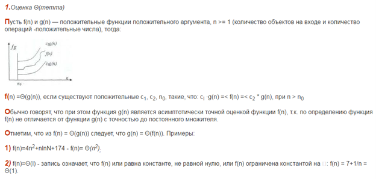
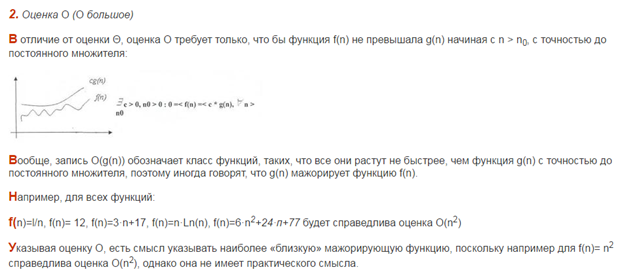
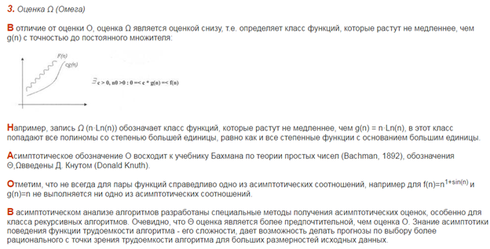
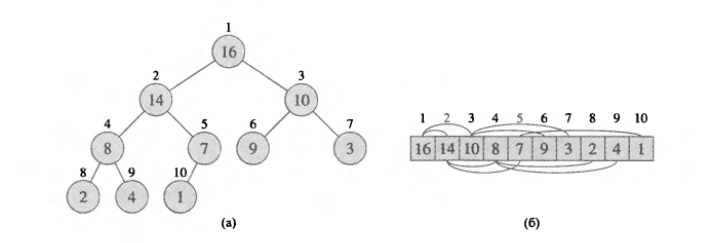
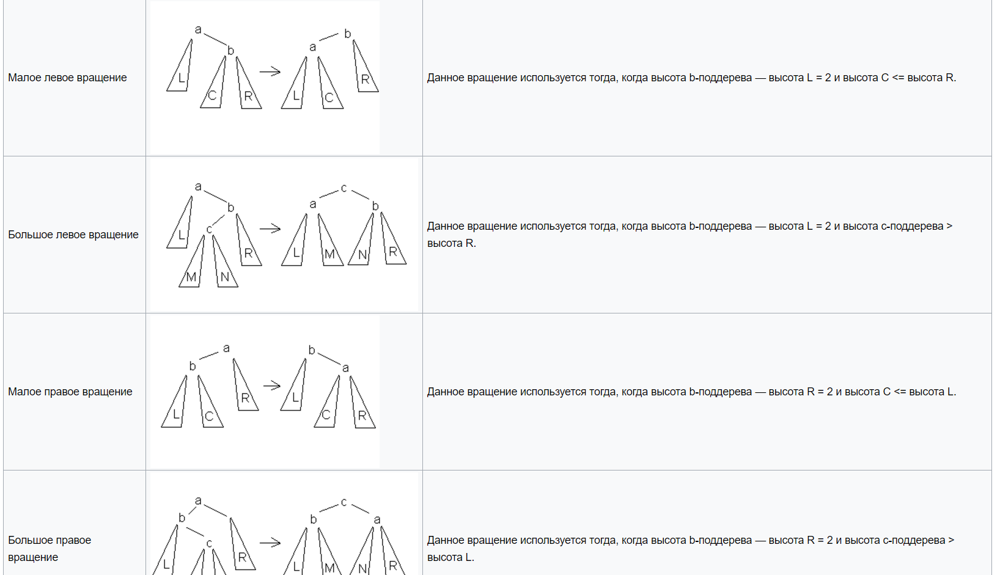
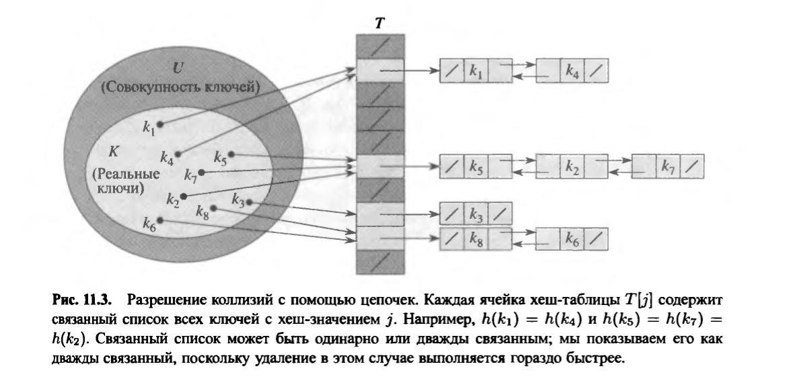

# 1 Алгоритмы. Анализ алгоритмов. Асимптотическое обозначение.

## Алгоритмы

**Алгоритм** - точное предписание, однозначнно определяющее вычислительный процесс, ведущий к исходным данным.
>Говоря неформально, алгоритм — это любая корректно определенная вычислительная процедура, на вход (input) которой подается некоторая величина или набор величин и результатом выполнения которой является выходная (output) величина или набор значений. Таким образом, алгоритм представляет собой последовательность вычислительных шагов, преобразующих входные величины в выходные.  
Алгоритм также можно рассматривать как инструмент, предназначенный для решения корректно поставленной вычислительной задачи (computational problem). В постановке задачи в общих чертах задаются отношения между входом и выходом. В алгоритме описывается конкретная вычислительная процедура, с помощью которой удается добиться выполнения указанных отношений.

## Анализ алгоритмов

>Анализ заключается в том, чтобы предсказать требуемые для его выполнения ресурсы. Иногда оценивается потребность в таких ресурсах, как память, пропускная способность сети или необходимое аппаратное обеспечение, но чаще всего определяется время вычисления. Путем анализа нескольких алгоритмов, предназначенных для решения одной и той же задачи, можно выбрать наиболее эффективный из них. В процессе такого анализа может также оказаться, что несколько алгоритмов примерно равноценны, а многие алгоритмы в процессе анализа часто приходится отбрасывать.  
Прежде чем мы научимся анализировать алгоритмы, необходимо разработать технологию, которая будет для этого использоваться. В эту технологию нужно будет включить модель ресурсов и величины их измерения. С учетом того, что алгоритмы реализуются в виде компьютерных программ, в этой книге в большинстве случаев в качестве технологии реализации принята модель обобщенной однопроцессорной машины с памятью с произвольным доступом (Random-Access Machine — RAM). В этой модели команды процессора выполняются последовательно; одновременно выполняемые операции отсутствуют.  
Строго говоря, в модели RAM следует точно определить набор инструкций и время их выполнения, однако это утомительно и мало способствует пониманию принципов разработки и анализа алгоритмов. С другой стороны, нужно соблюдать осторожность, чтобы не исказить модель RAM. Например, что будет, если в RAM встроена команда сортировки? В этом случае сортировку можно выполнять с помощью всего одной команды процессора. Такая модель нереалистична, поскольку настоящие компьютеры не имеют подобных встроенных команд, а мы ориентируемся именно на их устройство. В рассматриваемую модель входят те команды, которые обычно можно найти в реальных компьютерах: арифметические (сложение, вычитание, умножение, деление, вычисление остатка от деления, приближение действительного числа ближайшим меньшим или ближайшим большим целым), операции перемещения данных (загрузка, занесение в память, копирование) и управляющие (условное и безусловное ветвление, вызов подпрограммы и возврат из нее). Для выполнения каждой такой инструкции требуется определенный фиксированный промежуток времени.  
В модели RAM есть целочисленный тип данных и тип чисел с плавающей точкой (для хранения действительных чисел). Несмотря на то что обычно в этой книге точность не рассматривается, в некоторых приложениях она играет важную роль. Также предполагается, что существует верхний предел размера слова данных. Например, если обрабатываются входные данные с максимальным значением п, обычно предполагается, что целые числа представлены clgn битами для некоторой константы с > 1. Требование с > 1 обусловлено тем, что в каждом слове должно храниться одно из п значений, что позволит индексировать входные элементы. Кроме того, предполагается, что с — это конечная константа, поэтому объем слова не может увеличиваться до бесконечности. (Если бы это было возможно, в одном слове можно было бы хранить данные огромных объемов и осуществлять над ними операции в рамках одной элементарной команды, что нереально.)

## Асимптотическое обозначение

Целью асимптотического анализа является сравнение затрат времени и других ресурсов различными алгоритмами, предназначенными для решения одной и той же задачи, при больших объемах входных данных.  
Асимптотические обозначения позволяют показать скорость роста функции, маскируя при этом конкретные коэффициенты.



 

 # 2 Сортировка вставками. Сортировка слиянием. Анализ алгоритмов сортировки.

**Дано:** последовательность чисел **a1, a2 ... an**  
**Вывод:** перестановка **a1, a2 ... an**, где **a1 < a2 < ... < an**

## Сортировка вставками

Считаем, что первый элемент отсортирован, поэтому ставим указатель на 2 элемент.

Если элемент слева больше, то меняем их местами. Снова сравниваем, до тех пор пока элемент слева будет равен или меньше чем наш, или пока мы не дойдем до начала массива.

Перемещаем указатель вправо и опять сравниваем.

  
*Красный указатель*
```python
for i in range(1, len(A)):
    key = A[i]
    m = i
    while (A[m-1] > key) & (m > 0):
        A[m] = A[m-1]
        m -= 1
    A[m] = key
```

Мы имеем два цикла, каждый из которых повторяется примерно по **cn** раз, значит худшее время **n²**  
Так как мы используем только массив **A[1..n]**, значит затрата памяти n

Вычислительная сложность: **O(n²)**   
Затрата памяти: **O(n)**

## Сортировка слиянием

1. Массив разбивается на две равные части
2. Каждая из получившихся частей рекурсивно сортируется  
Рекурсивное разбиение задачи на меньшие происходит до тех пор, пока размер массива не достигнет единицы.
3. Два упорядоченных массива соединяются в один

Пусть мы имеем два уже отсортированных по неубыванию подмассива. Тогда:  
3.2. Слияние двух подмассивов в третий результирующий массив.  
На каждом шаге мы берём меньший из двух первых элементов подмассивов и записываем его в результирующий массив. Счётчики номеров элементов результирующего массива и подмассива, из которого был взят элемент, увеличиваем на 1.  
3.3. «Прицепление» остатка.  
Когда один из подмассивов закончился, мы добавляем все оставшиеся элементы второго подмассива в результирующий массив.  


```python
def mergesort(A):
    if len(A) > 1:
        mid = int(len(A)/2)
        lefthalf = A[:mid]
        righthalf = A[mid:]

        mergesort(lefthalf)
        mergesort(righthalf)

        i = 0
        j = 0
        k = 0
        while i < len(lefthalf) and j < len(righthalf):
            if lefthalf[i] < righthalf[j]:
                A[k] = lefthalf[i]
                i = i + 1
            else:
                A[k] = righthalf[j]
                j = j + 1
            k = k + 1

        while i < len(lefthalf):
            A[k] = lefthalf[i]
            i = i+1
            k = k+1

        while j < len(righthalf):
            A[k] = righthalf[j]
            j = j + 1
            k = k + 1
    return A      
```

Построим дерево рекурсии  


Один уровень равен **cn**  
Количество уровней дерева(высота) **lg n + 1**

>Общее количество уровней дерева рекурсии на рисунке равно lg n + 1, где n — количество листьев, соответствующее размеру входных данных. Это легко понять из неформальных индуктивных рассуждений. В простейшем случае, когда n = 1, имеется всего один уровень. Поскольку lg 1 =0, выражение lg n + 1 дает правильное количество уровней.  

**(lg n + 1) * cn = cn log n + cn**, значит худшее время **n log n**  
Так как мы используем только массив **A[1..n]**, значит затрата памяти n

Вычислительная сложность: **O(n log n)**   
Затрата памяти: **O(n)**
# 3 Пирамиды. Реализация и анализ операций вставки и удаления элементов пирамиды.

 


## Вставка

```python
def insert(self,k):
    self.heap_list.append(k) 
    self.size = self.size + 1 
    i = self.size 
    while i // 2 > 0:
        if self.heap_list[i] < self.heap_list[i // 2]: 
            tmp = self.heap_list[i // 2] 
            self.heap_list[i // 2] = self.heap_list[i] 
            self.heap_list[i] = tmp
        i = i // 2
```
O(n)
## Удаление элементов
```python
def extract_min(self):
    r = self.heap_list[1]
    self.heap_list[1] = self.heap_list[self.size]
    self.size = self.size - 1
    self.heap_list.pop()
    i = 1
    while (i * 2) <= self.size:
        mc = self.min_child(i)
        if self.heap_list[i] > self.heap_list[mc]:
            tmp = self.heap_list[i]
            self.heap_list[i] = self.heap_list[mc]
            self.heap_list[mc] = tmp
        i = mc
    return r
```# 4 Пирамиды. Пирамидальная сортировка. Анализ алгоритма пирамидальной сортировки.

 

просеевание
сортировка
```python
def heap(self, l):
    size = len(l)-1

    for i in range(size, -1, -1):
        if 2 * i + 1 <= size:
            if l[i] > l[2 * i + 1]:
                l[i], l[2 * i + 1] = l[2 * i + 1], l[i]
        if 2 * i + 2 <= size:
            if l[i] > l[2 * i + 2]:
                l[i], l[2 * i + 2] = l[2 * i + 2], l[i]
```
n log n# 5 Двоичные деревья поиска. Реализация и анализ операций вставки и удаления элементов дерева.

**Двоичные деревья** - это структуры данных, состоящие из узлов, которые хранят значение, а также ссылку на свою левую и правую ветвь. 

Каждая ветвь, в свою очередь, является деревом. Узел, который находится н самой вершине дерева принято называть корнем, узлы, находящиеся в самом низу дерева и не имеющие потомков называют листьями. Ветви узла называют потомками. По отношению к своим потомкам узел является родителем или предком. Также, развивая аналогию, имеются сестринские узлы - узлы с общим родителем

Бинарное дерево, это единственная в своем роде структура представления данных. Используется, например, для реализации базы данных.

```python
def insert(self, k):
    """Вставить элемент с ключем k"""
    new = BSTnode(k)
    if self.root is None:
        self.root = new
    else:
        node = self.root
        while True:
            if k < node.key:
                if node.left is None:
                    node.left = new
                    new.parent = node
                    break
                node = node.left
            else:
                if node.right is None:
                    node.right = new
                    new.parent = node
                    break
                node = node.right
    self.rebalance(new)
    return new
```# 6 Двоичные деревья поиска. Анализ алгоритма сортировки с помощью двоичного дерева.

**Двоичные деревья** - это структуры данных, состоящие из узлов, которые хранят значение, а также ссылку на свою левую и правую ветвь. 

Каждая ветвь, в свою очередь, является деревом. Узел, который находится н самой вершине дерева принято называть корнем, узлы, находящиеся в самом низу дерева и не имеющие потомков называют листьями. Ветви узла называют потомками. По отношению к своим потомкам узел является родителем или предком. Также, развивая аналогию, имеются сестринские узлы - узлы с общим родителем

Бинарное дерево, это единственная в своем роде структура представления данных. Используется, например, для реализации базы данных.

## Анализ алгоритма сортировки с помощью двоичного дерева

Сортировка с помощью дерева осуществляется на основе бинарного дерева поиска Бинарное (двоичное) дерево поиска - это бинарное дерево, для которого выполняются следующие дополнительные условия (свойства дерева поиска):

* оба поддерева - левое и правое, являются двоичными деревьями поиска
* у всех узлов левого поддерева произвольного узла X значения ключей данных меньше, чем значение ключа данных самого узла X;
* у всех узлов правого поддерева произвольного узла X значения ключей данных не меньше, чем значение ключа данных узла X.

Данные в каждом узле должны обладать ключами, на которых определена операция сравнения меньше.

Для сортировки с помощью дерева исходная сортируемая последовательность представляется в виде структуры данных "дерево".

Например, исходная последовательность имеет вид: 4, 3, 5, 1, 7, 8, 6, 2

Корнем дерева будет начальный элемент последовательности Далее все элементы, меньшие корневого, располагаются в левом поддереве, все элементы, большие корневого, располагаются в правом поддереве Причем это правило должно соблюдаться на каждом уровне

После того, как все элементы размещены в структуре "дерево", необходимо вывести их, используя обход дерева в симметричном порядке (слева направо)

Используется, например, для сортировки по именам в базе данных в виде бинарного дерева.

Анализ:
Если элементы массива различны и расположены в случайном порядке, а длина массива N, алгоритм требует в среднем O(n log n) операций. Если они уже отсортированы в возрастающем или убывающем порядке, то дерево становится несбалансированным (то есть у него появляется много пустых веток). Тогда алгоритм требует О(n^2) операций, и это худший возможный случай.# 7 Сбалансированные деревья поиска. Алгоритмы и анализ.

АВЛ дерево - сбалансированное по высоте двоичное дерево поиска: для каждой его вершины высота её двух поддеревьев различается не более чем на 1.
>АВЛ аббревиатура, образованная первыми буквами создателей (советских ученых) Аделвсон Вельского Георгия Максимовича и Ландиса Евгения Михайловича.

## Алгоритм добавления вершины

Первый шаг аналогичен добавлению вершины в двоичное дерево поиска. Далее производится балансировка всех предков добавленной вершины в порядке от родителя к корню.
Относительно АВЛ дерева балансировкой вершины называется операция, которая в случае разницы высот левого и правого поддеревьев - 2, изменяет связи предок потомок в поддереве данной вершины так, что разница становится <= 1. иначе ничего не меняет. Указанный результат получается вращениями поддерева данной вершины.

```python
def rebalance(self, node):
    """Ребаланс node"""
    while node is not None:
        update_height(node)
        if height(node.left) >= 2 + height(node.right):
            if height(node.left.left) >= height(node.left.right):
                self.right_rotate(node)
            else:
                self.left_rotate(node.left)
                self.right_rotate(node)
        elif height(node.right) >= 2 + height(node.left):
            if height(node.right.right) >= height(node.right.left):
                self.left_rotate(node)
            else:
                self.right_rotate(node.right)
                self.left_rotate(node)
        node = node.parent
```

## Вращения на листочке



## Анализ

Из-за условия балансированное высота дерева O(lg(N)). где N количество вершин, позтому добавление элемента требует O(lg(N)) операций.
>Применяют AVL деревья только там, где поиск является доминирующей операцией.

## Алгоритм удаления

Для простоты опишем рекурсивный алгоритм удаления. Если вершина - лист, то удалим ее и вызовем балансировку всех ее предков в порядке от родителя к корню Иначе найдем самую близкую по значению вершину в поддереве наибольшей высоты (правом или левом) и переместим её на место удаляемой вершины, при этом вызвав процедуру её удаления
# 8 Хэширование. Хеш-функции. Хеширование с раздельными цепочками.

**Хэширование** - структура данных, в которой можно будет осуществлять, поиск за время O(1).  
Если каждый элемент находится там где ему следует быть, то поиск может использовать только сравнения для обнаружения присутствия искомого.

**Хэш-таблица** это коллекция элементов, которые сохраняются таким образом чтобы позже их было легко найти. Каждая позиция в хэш-таблице (часто называемая слотом) может содержать собственно элемент и целое число, начинающееся с нуля. Например, у нас есть слот 0, слот 1, слот 2 и так далее.  
Первоначально хэш таблица не содержит элементов, так что каждый из слотов пуст.

## Хеш-функции

Связь между элементом и слотом, в который он кладётся, называется **хэш-функцией**. Она принимает любой элемент из коллекции и возвращает целое число из диапазона имен слотов (от О до m-1).  
Для заданной коллекции элементов хэш функция, связывающая каждый из них c уникальным слотом, называется **идеальной хэш-функцией**

### Метод деления

Построение хеш-функции методом деления состоит в отображении ключа **к** в одну из **m** ячеек путем получения остатка от деления **к** на **m**:

**h(k) = к mod m**

>Например, если хеш-таблица имеет размер **m = 12**, а значение ключа **k = 100**, то **h(k) = 4**. Поскольку для вычисления хеш-функции требуется только одна операция деления, хеширование методом деления достаточно быстрое.

>Число **m** не должно быть степенью **2**, поскольку если **m = 2^Р**, то **h(k)** представляет собой просто **р** младших битов числа **k**.  
>Зачастую хорошие результаты можно получить, выбирая в качестве значения **m** простое число, достаточно далекое от степени двойки. Например, мы хотим создать хеш-таблицу с разрешением коллизий методом цепочек для хранения порядка **n = 2000** символьных строк, размер символов в которых равен **8 бит**. Нас устраивает проверка в среднем трех элементов при неудачном поиске, так что мы выбираем размер таблицы равным **m = 701**. Число **701** выбрано как простое число, близкое к величине **2000/3** и не являющееся степенью **2**. Рассматривая каждый ключ к как целое число, мы получаем искомую хеш-функцию  
**h(k) = к mod 701**

### Метод умножения

Построение хеш-функции методом умножения выполняется в два этапа. Сначала мы умножаем ключ к на константу 0 < А < 1 и выделяем дробную часть полученного произведения. Затем мы умножаем полученное значение на m и выделяем целую часть:
h(k) = ⌊m (кА mod 1)⌋

### Универсальное хэширование

Если специально подбирать данные, можно попасть в такую ситуацию, когда все ключи будут соответствовать одной позиции в хеш-таблице, тогда время поиска индекса может достигать времени поиска в списке. Выход из данной ситуации — **универсальное хеширование** — выбор хеш-функции во время исполнения программы случайным образом из некоторого множества хеш-функций. Т.е. при повторном вызове алгоритма с теми же данными алгоритм может работать уже совсем по-другому.

## Хеширование с раздельными цепочками

Два ключа могут быть хешированны в одну и ту же ячейку. Такая ситуация называется **коллизией**.

Технология сцепления элементов состоит в том, что элементы множества, которым соответствует одно и то же хеш-значение, связываются в цепочку-список. В позиции номер i хранится указатель на голову списка тех элементов, у которых хеш-значение ключа равно i; если таких элементов в множестве нет, в позиции j записан NULL.


# 9 Хэширование. Хеш-функции. Хеширование с открытой адресацией.

**Хэширование** - структура данных, в которой можно будет осуществлять, поиск за время O(1).  
Если каждый элемент находится там где ему следует быть, то поиск может использовать только сравнения для обнаружения присутствия искомого.

**Хэш-таблица** это коллекция элементов, которые сохраняются таким образом чтобы позже их было легко найти. Каждая позиция в хэш-таблице (часто называемая слотом) может содержать собственно элемент и целое число, начинающееся с нуля. Например, у нас есть слот 0, слот 1, слот 2 и так далее.  
Первоначально хэш таблица не содержит элементов, так что каждый из слотов пуст.

## Хеш-функции

Связь между элементом и слотом, в который он кладётся, называется **хэш-функцией**. Она принимает любой элемент из коллекции и возвращает целое число из диапазона имен слотов (от О до m-1).  
Для заданной коллекции элементов хэш функция, связывающая каждый из них c уникальным слотом, называется **идеальной хэш-функцией**

### Метод деления

Построение хеш-функции методом деления состоит в отображении ключа **к** в одну из **m** ячеек путем получения остатка от деления **к** на **m**:

**h(k) = к mod m**

>Например, если хеш-таблица имеет размер **m = 12**, а значение ключа **k = 100**, то **h(k) = 4**. Поскольку для вычисления хеш-функции требуется только одна операция деления, хеширование методом деления достаточно быстрое.

>Число **m** не должно быть степенью **2**, поскольку если **m = 2^Р**, то **h(k)** представляет собой просто **р** младших битов числа **k**.  
>Зачастую хорошие результаты можно получить, выбирая в качестве значения **m** простое число, достаточно далекое от степени двойки. Например, мы хотим создать хеш-таблицу с разрешением коллизий методом цепочек для хранения порядка **n = 2000** символьных строк, размер символов в которых равен **8 бит**. Нас устраивает проверка в среднем трех элементов при неудачном поиске, так что мы выбираем размер таблицы равным **m = 701**. Число **701** выбрано как простое число, близкое к величине **2000/3** и не являющееся степенью **2**. Рассматривая каждый ключ к как целое число, мы получаем искомую хеш-функцию  
**h(k) = к mod 701**

### Метод умножения

Построение хеш-функции методом умножения выполняется в два этапа. Сначала мы умножаем ключ к на константу 0 < А < 1 и выделяем дробную часть полученного произведения. Затем мы умножаем полученное значение на m и выделяем целую часть:
h(k) = ⌊m (кА mod 1)⌋

### Универсальное хэширование

Если специально подбирать данные, можно попасть в такую ситуацию, когда все ключи будут соответствовать одной позиции в хеш-таблице, тогда время поиска индекса может достигать времени поиска в списке. Выход из данной ситуации — **универсальное хеширование** — выбор хеш-функции во время исполнения программы случайным образом из некоторого множества хеш-функций. Т.е. при повторном вызове алгоритма с теми же данными алгоритм может работать уже совсем по-другому.

## Хеширование с открытой адресацией

В случае метода **открытой адресации** (или по-другому: *закрытого хеширования*) все элементы хранятся непосредственно в хеш-таблице, без использования связанных списков. В отличии от хеширования с цепочками, при использовании метода открытой адресации может возникнуть ситуация, когда хеш-таблица окажется полностью заполненной, так что будет невозможно добавлять в неё новые элементы. Так что при возникновении такой ситуации решением может быть динамическое увеличение размера хеш-таблицы, с одновременной её перестройкой.

Однако здесь есть одна проблема: два ключа могут быть хешированны в одну и ту же ячейку. Такая ситуация называется **коллизией**.

Для разрешения же коллизий применяются несколько подходов. Самый простой из них - это **метод линейного исследования**. В этом случае при возникновении коллизии следующие за текущей ячейки проверяются одна за другой, пока не найдётся пустая ячейка, куда и помещается наш элемент. Так, при достижении последнего индекса таблицы, мы перескакиваем в начало, рассматривая её как «цикличный» массив.


Линейное хеширование достаточно просто реализуется, однако с ним связана существенная проблема - **кластеризация**. Это явление создания длинных последовательностей занятых ячеек, которое увеличивает среднее время поиска в таблице. Для снижения эффекта кластеризации используется другая стратегия разрешения коллизий - **двойное хеширование**. Основная идея заключается в том, что для определения шага смещения исследований при коллизии в ячейке используется другая хеш-функция, вместо линейного смещения на одну позицию.

Одной из сложных вопросов реализации хеширования с открытой адресацией - это операция удаления элемента. Дело в том, что если мы просто удалим некий элемент их хеш-таблицы, то сделаем невозможным поиск ключа, в процессе вставки которого текущая ячейка оказалась заполненной. Так, мы можем помечать очищенные ячейки какой-то меткой, чтобы впоследствии это учитывать.

Применение - словари, текстовые редакторы, списки
